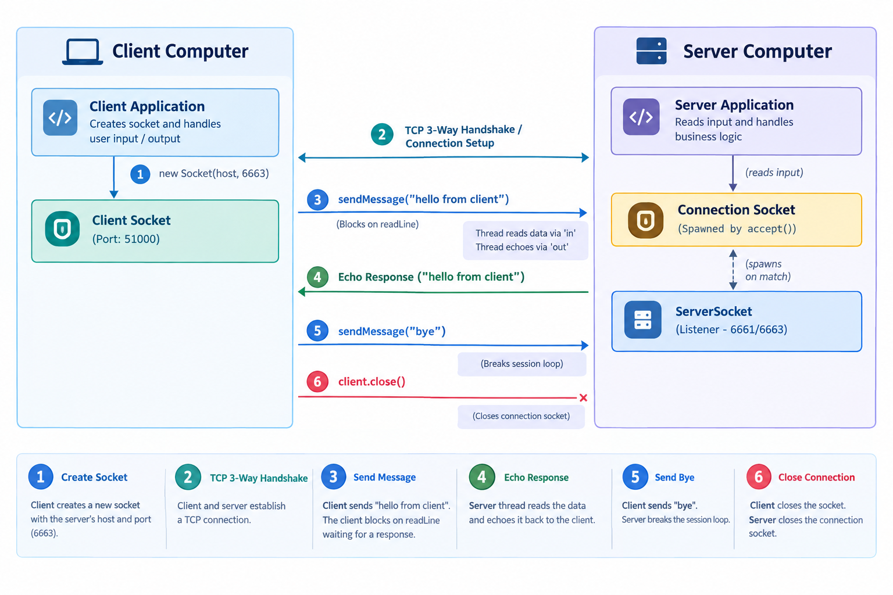
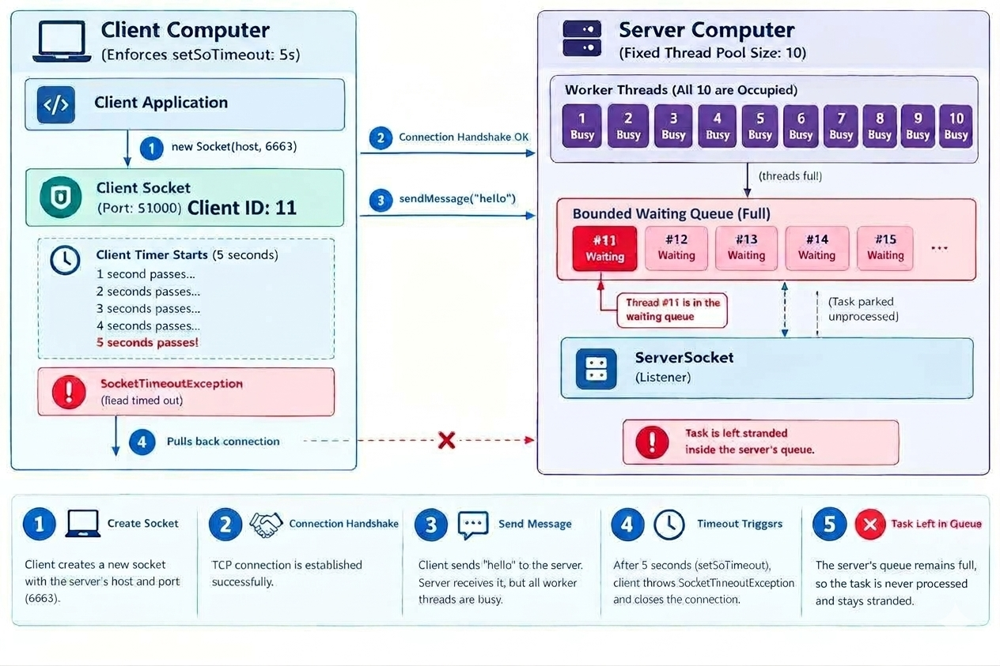
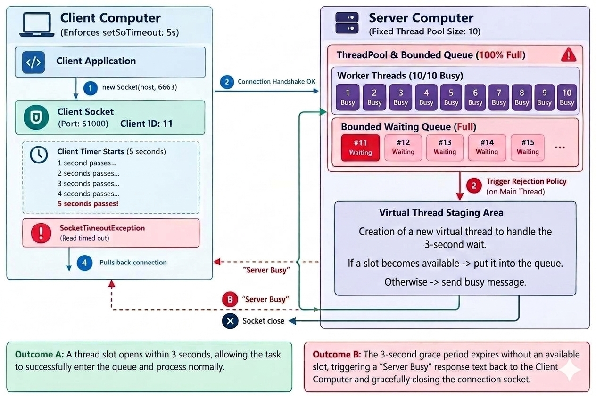
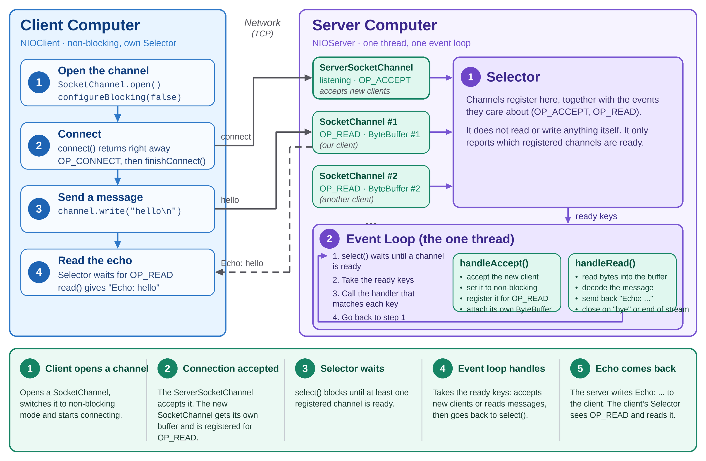

# Java Sockets

## Problem

Applications that continuously exchange data between two machines, like a chat app, need to communicate reliably over a network. If the underlying communication mechanism loses or reorders data, it can lead to incorrect or incomplete application behavior.

So we need a communication mechanism that provides:

- **Reliable delivery** — data should not be lost silently.
- **Ordered delivery** — data should be received in the order it was sent.

A chat app also isn't a one-time exchange — both people send and receive messages throughout an ongoing conversation. So we also need:

- **Two-way communication** — both machines should be able to send and receive data.
- **Continuous communication** — the connection should support repeated data exchange without establishing a new connection for every message.

# Choosing the Communication Mode

We already know a chat app needs two-way, continuous communication. That rules out one of the three basic modes right away:

- **Simplex** — data flows in one direction only, so two-way communication is off the table.

That leaves:

- **Half-duplex** — both sides can send and receive, but they take turns. This is enough for strict request/response exchanges, and the echo code in this project works that way: the client sends a line, then waits for the reply.
- **Full-duplex** — both sides can send and receive simultaneously.

In a real chat, either person can send at any moment, even while a message is arriving, so **full-duplex** is the natural fit.

# Why TCP?

We've already established that we need **reliable, ordered, full-duplex, and continuous** communication. **TCP (Transmission Control Protocol)** happens to satisfy all four in one package:

- **Connection-oriented** — once a connection is set up between two machines, it stays open until one side closes it (or the network breaks it), giving us continuous communication without reconnecting for every message.
- **Reliable** — lost data is detected and resent, so nothing is dropped silently. If the connection fails, you get an error instead.
- **Ordered** — data arrives in the sequence it was sent.
- **Full-duplex** — once the connection is established, both sides can send and receive at the same time.

So TCP isn't just *a* protocol with nice properties — its properties are exactly the requirements we started with. That's why it's the transport protocol behind applications like chat.

One thing TCP does *not* give you is message boundaries: it is a stream of bytes, so two messages can arrive in one read, or one message in two reads. That's why this project's protocol sends one line per message and lets `readLine()` find the boundaries.

# Where Do Sockets Fit?

We've settled on TCP as the transport protocol — but TCP itself is just a set of rules for how data should move reliably over a network. An application can't "talk TCP" directly; it needs a concrete interface to open a connection, send bytes, and receive them.

That's what a **socket** is: one endpoint of a two-way communication link, identified by the combination of an **IP address** and a **port number**. The IP address gets the data to the right machine; the port gets it to the right application running on that machine.

In Java, this interface is the `Socket` class — it gives the application methods to send and receive data through a TCP connection, without needing to manage the underlying protocol itself. On the server side, a `ServerSocket` listens for connections.

One asymmetry worth noticing: the server's port is fixed — the developer picks it ahead of time (like 6661 here) so clients know where to find it.
The client's port isn't chosen by the developer at all; the OS assigns an available one automatically the moment the socket opens. That's why the diagram's client port (51000) looks arbitrary while the server's matches the code you're about to see.

<svg width="100%" viewBox="0 0 680 236" role="img">
<title>Client and server communicating through sockets over a TCP connection</title>
<desc>A client application connects through a client socket identified by an IP address and port, over a TCP connection, to a server socket identified by its own IP address and port, which connects to the server application.</desc>
<defs>
<marker id="arrow" viewBox="0 0 10 10" refX="8" refY="5" markerWidth="6" markerHeight="6" orient="auto-start-reverse"><path d="M2 1L8 5L2 9" fill="none" stroke="#5F5E5A" stroke-width="1.5" stroke-linecap="round" stroke-linejoin="round"/></marker>
</defs>
<rect x="60" y="40" width="200" height="44" rx="8" fill="#E6F1FB" stroke="#185FA5" stroke-width="0.5"/>
<text x="160" y="62" text-anchor="middle" dominant-baseline="central" font-size="14" font-weight="500" fill="#0C447C">Client application</text>
<rect x="420" y="40" width="200" height="44" rx="8" fill="#E1F5EE" stroke="#0F6E56" stroke-width="0.5"/>
<text x="520" y="62" text-anchor="middle" dominant-baseline="central" font-size="14" font-weight="500" fill="#085041">Server application</text>
<line x1="160" y1="84" x2="160" y2="140" stroke="#5F5E5A" stroke-width="1.5" marker-end="url(#arrow)"/>
<line x1="520" y1="84" x2="520" y2="140" stroke="#5F5E5A" stroke-width="1.5" marker-end="url(#arrow)"/>
<rect x="60" y="140" width="200" height="56" rx="8" fill="#E6F1FB" stroke="#185FA5" stroke-width="0.5"/>
<text x="160" y="158" text-anchor="middle" dominant-baseline="central" font-size="14" font-weight="500" fill="#0C447C">Client socket</text>
<text x="160" y="176" text-anchor="middle" dominant-baseline="central" font-size="12" fill="#185FA5">IP 192.168.1.5:51000</text>
<rect x="420" y="140" width="200" height="56" rx="8" fill="#E1F5EE" stroke="#0F6E56" stroke-width="0.5"/>
<text x="520" y="158" text-anchor="middle" dominant-baseline="central" font-size="14" font-weight="500" fill="#085041">Server socket</text>
<text x="520" y="176" text-anchor="middle" dominant-baseline="central" font-size="12" fill="#0F6E56">IP 192.168.1.10:6661</text>
<line x1="262" y1="168" x2="418" y2="168" stroke="#5F5E5A" stroke-width="1.5" marker-start="url(#arrow)" marker-end="url(#arrow)"/>
<text x="340" y="150" text-anchor="middle" font-size="12" fill="#5F5E5A">TCP connection</text>
</svg>

A small detail about the diagram: on the server, the `ServerSocket` only *listens* on port 6661. When a client connects, `accept()` returns a new `Socket` for that one connection, and that is the "server socket" end of the TCP connection shown above.

## How Sockets Work



# Code Walkthrough

Now let's see how the concepts above show up as actual code — starting with the server side.

## Server

It opens a `ServerSocket` on a fixed port, waits for a client to connect, and echoes back whatever it receives until the client sends `"bye"`.

```java
import java.io.BufferedReader;
import java.io.IOException;
import java.io.InputStreamReader;
import java.io.PrintWriter;
import java.net.ServerSocket;
import java.net.Socket;
import java.nio.charset.StandardCharsets;
import java.util.logging.Level;
import java.util.logging.Logger;
 
public class Server {
 
    private static final Logger logger = Logger.getLogger(Server.class.getName());
 
    public void start(int port) throws IOException {
        try (
            // Binds a socket to the given port and starts listening for connections.
            ServerSocket serverSocket = new ServerSocket(port)) {
            logger.info("Server started on port " + port + ". Waiting for a client to connect...");
 
            try (
                // Blocks until a client connects, then returns a socket for that specific connection.
                Socket clientSocket = serverSocket.accept();
                // Wraps the socket's input stream so incoming text can be read line by line.
                // UTF-8 is explicit here so it matches the client's encoding exactly.
                BufferedReader in = new BufferedReader(new InputStreamReader(clientSocket.getInputStream(), StandardCharsets.UTF_8));
                // Wraps the socket's output stream so text can be sent back to the client.
                PrintWriter out = new PrintWriter(clientSocket.getOutputStream(), true, StandardCharsets.UTF_8)) {
 
                logger.info("Client connected from " + clientSocket.getInetAddress());
                handleSession(in, out);
            } catch (IOException e) {
                logger.log(Level.SEVERE, "Error while handling client connection", e);
                throw e;
            } finally {
                logger.info("Client connection closed.");
            }
        } catch (IOException e) {
            logger.log(Level.SEVERE, "Server failed to start on port " + port, e);
            throw e;
        }
    }
 
    // Echoes each line back to the client until "bye" is received.
    void handleSession(BufferedReader in, PrintWriter out) throws IOException {
        String input;
        while ((input = in.readLine()) != null) {
            logger.info("Received from client: " + input);
            out.println(input);
            logger.info("Sent to client: " + input);
 
            if (input.equals("bye")) {
                logger.info("Client sent 'bye'. Ending session.");
                break;
            }
        }
    }
 
    public static void main(String[] args) throws IOException {
        Server server = new Server();
        server.start(6661);
    }
}
```

A few things worth connecting back to what we covered:

- `ServerSocket` is the thing listening on port `6661`, waiting for a connection on that port. It only listens: it never carries chat data itself.
- `serverSocket.accept()` is the moment a client actually connects — it blocks until that happens, then hands back a `Socket` representing that one connection. This returned `Socket` is the server end of the connection in the diagram.
- `BufferedReader` and `PrintWriter` are just conveniences for reading and writing text over the socket's raw input/output streams — because the connection is full-duplex, `in` and `out` are independent streams (this echo server just happens to use them in turn).

One limitation worth knowing: `start()` calls `accept()` only once, so this server handles exactly one client, then stops. A real chat server would loop on `accept()` or hand each connection off to its own thread — but that's a step beyond what this article covers.

## Client

The client mirrors the server's side of the diagram — it opens a socket to the server's fixed IP:port, but its own port is assigned automatically by the OS the moment the connection is made.

```java
import java.io.BufferedReader;
import java.io.IOException;
import java.io.InputStreamReader;
import java.io.PrintWriter;
import java.net.Socket;
import java.nio.charset.StandardCharsets;
import java.util.logging.Level;
import java.util.logging.Logger;
 
public class Client implements AutoCloseable {
 
    private static final Logger logger = Logger.getLogger(Client.class.getName());
    private static final int DEFAULT_READ_TIMEOUT_MS = 10_000;
 
    private Socket socket;
    private BufferedReader in;
    private PrintWriter out;
 
    public Client() {
    }
 
    // Package-private: lets unit tests inject streams directly, without a real socket.
    Client(BufferedReader in, PrintWriter out) {
        this.in = in;
        this.out = out;
    }
 
    public void connect(String host, int port) throws IOException {
        connect(host, port, DEFAULT_READ_TIMEOUT_MS);
    }
 
    public void connect(String host, int port, int readTimeoutMs) throws IOException {
        logger.info("Connecting to " + host + ":" + port + "...");
        try {
            socket = new Socket(host, port);
            // Prevents readLine() from blocking forever if the server never responds.
            socket.setSoTimeout(readTimeoutMs);
            out = new PrintWriter(socket.getOutputStream(), true, StandardCharsets.UTF_8);
            in = new BufferedReader(new InputStreamReader(socket.getInputStream(), StandardCharsets.UTF_8));
            logger.info("Connected to " + host + ":" + port);
        } catch (IOException e) {
            logger.log(Level.SEVERE, "Failed to connect to " + host + ":" + port, e);
            throw e;
        }
    }
 
    public String sendMessage(String message) throws IOException {
        // Both sides talk in terms of readLine()/println(), so a message containing
        // a newline would be split into two messages on the other end. Reject it here
        // to keep the line-based framing the whole protocol depends on.
        if (message.contains("\n") || message.contains("\r")) {
            String errorMessage = "message must not contain line breaks: \"" + message + "\"";
            logger.warning(errorMessage);
            throw new IllegalArgumentException(errorMessage);
        }
 
        try {
            logger.info("Sending: " + message);
            out.println(message);
            String response = in.readLine();
            logger.info("Received: " + response);
            return response;
        } catch (IOException e) {
            logger.log(Level.SEVERE, "Error sending/receiving message: " + message, e);
            throw e;
        }
    }
 
    @Override
    public void close() throws IOException {
        logger.info("Closing client connection...");
        if (in != null) {
            in.close();
        }
        if (out != null) {
            out.close();
        }
        if (socket != null) {
            socket.close();
        }
        logger.info("Client connection closed.");
    }
 
    public static void main(String[] args) throws IOException {
        try (Client client = new Client();
             BufferedReader consoleIn = new BufferedReader(new InputStreamReader(System.in))) {
 
            client.connect("localhost", 6661);
 
            String input;
            while ((input = consoleIn.readLine()) != null) {
                String response = client.sendMessage(input);
                System.out.println("Response: " + response);
                if (input.equals("bye")) {
                    break;
                }
            }
        }
    }
}
```

A few things worth connecting back to what we covered:

- `new Socket(host, port)` is what opens the client socket — the OS picks its port automatically, which is why the diagram shows an arbitrary-looking `51000` instead of a number the developer chose.
- `setSoTimeout` prevents `readLine()` from blocking forever if the server never responds — without it, a dropped connection could hang the client indefinitely. It only limits *reads*. To also limit how long *connecting* takes, create an unconnected `Socket` and call `socket.connect(new InetSocketAddress(host, port), timeoutMs)`.
- The line-break check in `sendMessage` isn't just input validation — both sides communicate one line at a time via `readLine()`/`println()`, so a message containing a newline would be read as two separate messages on the other end. This directly protects the line-based framing the protocol depends on.

One thing worth knowing: if the server closes the connection normally, `in.readLine()` returns `null` rather than throwing — so `sendMessage` returns `null`, and `main` prints `"Response: null"` instead of crashing. If the connection is reset instead (for example, the server process crashes), you get a `SocketException: Connection reset`.

## SocketTimeout Exception

By default, a Java socket client waits indefinitely, which is dangerous for real-world applications.
If the server hangs or gets stuck in a traffic jam, your client application freezes forever.

**Where it happens:** This exception occurs in the case of an `ExecutorServer` when the thread pool is full and
cannot handle the incoming load. Because the server's thread pool is exhausted, it cannot process the heavy burst
of concurrent traffic and parks the excessive connections inside its internal waiting queue.

**The Fix:** We must set a timeout boundary for the client. In this scenario, we enforce a client
timeout using `socket.setSoTimeout()`. The right value depends on your system; this project uses 5 to 10 seconds for reads. Keep in mind that `setSoTimeout()` limits only *reads* (connecting has its own timeout), and that it frees only the *client*: the server still holds the connection in its waiting queue.

**The Result:** When the client fails to receive an echo response within its designated deadline, instead of hanging
indefinitely, it throws a `SocketTimeoutException: Read timed out` because the **client** was unable to read a
response from the server:

```text
SEVERE: Error sending/receiving message: hello from client 83
java.net.SocketTimeoutException: Read timed out
..................
at com.practice.client.Client.sendMessage(Client.java:68)
at com.practice.loadTest.LoadTester.lambda$main$0(LoadTester.java:37)
```

---



## How the Rejection Policy Works

When the server gets completely full (all worker threads are busy and the waiting queue is packed),
the next connection triggers the `rejectedExecution` policy.

This policy runs synchronously on the Main Thread (the one running the serverSocket.accept() loop).
Instead of turning the client away instantly, we want the server to wait for 3 seconds to see if an active worker
finishes a chat and frees up a slot.

If the Main Thread sits and waits for those 3 seconds, the entire server freezes.
The front door slams shut: no new clients are accepted. Connections that arrive meanwhile are completed by the operating system, but nobody serves them, and once the OS's small pending-connection backlog fills up, new connection attempts start failing too.

To prevent a total freeze, the Main Thread instantly hands the overflowing client over to a
lightweight Virtual Thread and immediately loops back to accept more connections.
The Virtual Thread acts as an independent holding area for that specific client.

* **If an active chat finishes within 3 seconds:** A slot is freed. The Virtual Thread slips the client into the waiting queue, and they get processed normally.
* **If the 3 seconds run out and the server is still maxed out:** The Virtual Thread steps in, writes the "Server is busy" message directly to the client, and gracefully closes the connection.

---



## Traditional Threads in Sockets

Traditional threads are platform threads and they are expensive, heavyweight resources.
If thousands of clients connect at the same time, the server has to create thousands of platform threads.
Most of those threads will just sit there doing nothing, wasting system memory while waiting for a user to type a
message. Eventually, the server runs out of threads or memory, and clients begin experiencing connection failures or those dreaded SocketTimeoutException errors.

## Virtual Threads in Sockets

Introduced in Java 21, Virtual Threads completely change how we handle scale.

Virtual threads are incredibly lightweight. Instead of occupying a precious operating system thread for its entire life,
a virtual thread only "mounts" onto an OS thread when it is actively processing data.

When a client socket is waiting for data (like during `in.readLine()`), the virtual thread quietly "unmounts" from the OS
thread and copies its state onto the Java Heap (the server's general memory pool). This frees up the underlying OS
thread to handle someone else. The moment the client finally sends a message, the virtual thread jumps back onto an
available OS thread and resumes.

Because they are so cheap, a server can create very large numbers of virtual threads on a normal laptop (hundreds of thousands of idle ones is realistic). For sockets, the practical limit is then usually the operating system's open-file limit, since every connection holds an open file descriptor.

*(Note: Virtual threads are implemented in the `VirtualThreadServer` class).*

## Bounded Virtual Threads in Sockets

Virtual threads make serving many clients cheap, but nothing stops a flood of connections from exhausting memory or open-file limits. `BoundedVirtualThreadServer` sets firm boundaries using **semaphores**. Think of a semaphore as a nightclub bouncer with a clicker counter. This server has two:

* **Waiting queue (2,000 slots):** clients that have been accepted but are not being served yet.
* **Execution (5,000 slots):** clients actively chatting. A client waits in the waiting queue until an execution slot is free, then moves in.

When a connection arrives, the accept loop tries to take a waiting-queue slot, without waiting:

* **If a slot is free:** a virtual thread starts for the client, waits for an execution slot, then chats.
* **If the waiting queue is full:** the client is shed immediately, with no grace period. A short-lived virtual thread writes a polite "Server is busy" message and closes the socket, so the accept loop never waits and the server stays alive.

Compare this with `BoundedExecutorServer`, which gives overflowing clients a 3-second grace period before rejecting them.

*(Note: Bounded virtual threads are implemented in the `BoundedVirtualThreadServer` class).*

# Non-Blocking I/O (NIO)

So far every server in this project used **blocking** I/O: a thread calls `in.readLine()` and simply waits until the client sends something. That is easy to read and write, but it has a cost. Let's see why, and how NIO changes the picture.

## The problem: one waiting thread per client

Picture a restaurant where every table gets its own waiter, and each waiter just stands next to the table until the guests want something. Most of the time they are idle, yet each one still takes up space and has to be paid.

That is `ThreadedServer`: one thread per client, and almost all of them are sitting inside `readLine()` doing nothing. `ExecutorServer` limits how many waiters you hire, and `VirtualThreadServer` makes waiters very cheap. NIO takes a different route:

> **One waiter watches all the tables, and only walks over to a table when someone raises a hand.**

In code terms: **one thread** asks the operating system "which of my connections have something for me right now?" and handles only those.

## Blocking vs non-blocking

- **Blocking** `read()`: "I'll wait here until data arrives."
- **Non-blocking** `read()`: "Give me whatever is there *right now*." If nothing is there, it returns immediately instead of waiting.

A non-blocking read on its own is useless: you would have to keep asking "anything yet? anything yet?" in a loop, burning CPU. NIO solves this with a helper that does the waiting for you, the **Selector**.

## The three building blocks

| Classic (blocking) | NIO | What it is |
|---|---|---|
| `ServerSocket` | `ServerSocketChannel` | Listens for new connections |
| `Socket` | `SocketChannel` | One connection to a client |
| `InputStream`, `OutputStream`, `BufferedReader` | `ByteBuffer` | A box of bytes you read from and write into |
| One blocked thread per client | `Selector` | One object that watches many channels |

**Channel.** Think of it as a socket that *can* be switched to non-blocking mode with `configureBlocking(false)`.

**Buffer.** NIO does not give you streams. You hand the channel a `ByteBuffer`, and it fills it (for a read) or empties it (for a write). A `ByteBuffer` has a *position* (where the next byte goes) and a *limit* (how far you may go). Three methods switch it between "filling" and "reading":

- `flip()`: "I'm done filling it, now let me read what's inside."
- `clear()`: "Forget the contents, I want to fill it again from the start."
- `compact()`: "Keep the unread bytes, and make room after them." (This project doesn't need it, but you will meet it in real servers.)

**Selector.** You *register* channels with it and say which events you care about. Then `selector.select()` blocks until at least one of them is ready.

The events (`SelectionKey` operations):

| Event | Meaning |
|---|---|
| `OP_ACCEPT` | A new client is waiting to connect (server channel) |
| `OP_CONNECT` | Our own outgoing connection has finished connecting (client channel) |
| `OP_READ` | Data has arrived and can be read |
| `OP_WRITE` | The socket has room to send more data |

## The big picture

Here is how the pieces fit together:



## Traditional Threads in Sockets

1. A new client connects through the `ServerSocketChannel`. Each connected client then gets its own `SocketChannel` and its own buffer.
2. Every channel is *registered* with one `Selector`, together with the events we care about (`OP_ACCEPT`, `OP_READ`).
3. The single event-loop thread sleeps inside `select()`. When something happens, the `Selector` hands over only the channels that are ready.
4. The thread handles each ready channel (accept a client, read a message, write a reply) and then goes back to `select()`.

## What to watch out for

NIO's efficiency comes with more responsibility. The code in this project is deliberately simple, so it is worth knowing where the simplifications are.

- **Never block inside the event loop.** One thread serves everybody. If the loop sleeps for a second (like the `Thread.sleep(1000)` the other servers use to simulate work), *every* client waits. That is also why `NIOServer` has no simulated delay, and why its results can't be compared directly with the other servers.
- **One read is not always one message.** TCP is a stream of bytes. Two quick messages (`hello\nworld\n`) can arrive in one read, or one message can arrive in two pieces (`hel` and `lo\n`). `NIOServer` assumes that one read is one complete message, which works for the short messages in this project. A real server keeps each client's unfinished bytes in its buffer until it sees a newline. (The blocking servers don't have this problem because `readLine()` does that waiting for you.)
- **A write may be partial.** If the other side is slow, `write()` may send only part of the data. Real servers keep the rest and register for `OP_WRITE` to finish later.
- **A message longer than the buffer** (256 bytes here) is also split across reads.
- **Resources still grow with connections.** Each client costs a buffer and an open file descriptor, so a huge number of clients can still hit memory or open-file limits.
- **One thread uses one CPU core.** Production frameworks such as Netty run several selector loops so that all cores are used.
- **Shutting down.** `stop()` closes the selector from another thread, which interrupts the loop abruptly. A more careful version sets a flag, calls `selector.wakeup()`, and lets the loop close everything itself.

## Which approach should I choose?

| | Thread per client / pool | Virtual threads | NIO (event loop) |
|---|---|---|---|
| Code style | Simple, blocking | Simple, blocking | More complex, event-driven |
| Threads | One per client (or a pool) | One virtual thread per client | One for all clients |
| Scales to many connections | Poorly | Well | Well |
| Memory per connection | Large (thread stack) | Small | Usually smallest, but you manage the state yourself |

There is no single winner. Virtual threads give you most of the scalability while keeping the easy code, so they are often the first choice for new Java 21+ projects. NIO is worth learning because it shows what is happening underneath, and because many libraries and servers are built on it.